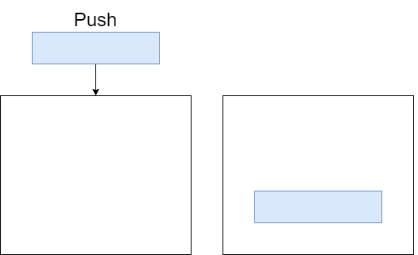
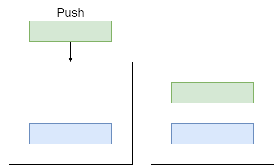
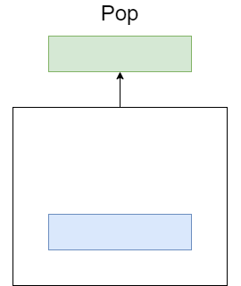
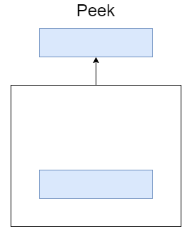
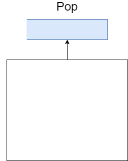

# MyGenericStack

## stack.Push("Blue")

**Stack Contains:**  
  Blue

## stack.Push("Green")

**Stack Contains:**  
  Green  
  Blue

## string item = stack.Pop();

**item:**  
  Green

**Stack Contains:**  
  Blue

## string item = stack.Peek();

**item:**  
  Blue

**Stack Contains:**  
  Blue

## string item = stack.Pop();

**item:**  
  Blue

**Stack Contains:**  
Empty
  

